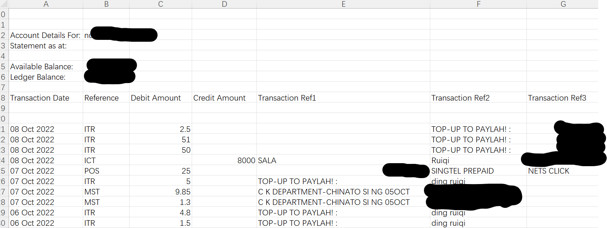
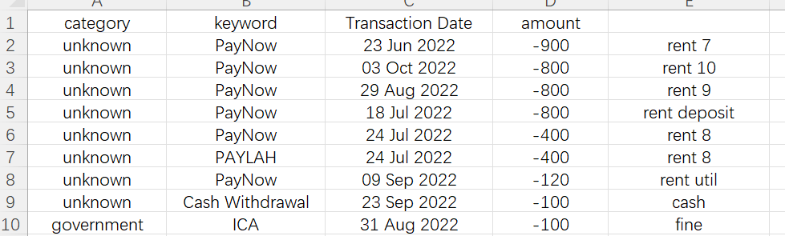

- [dbs bank](./dbs_bank)
    - convert transaction history from DBS bank to understandable table, the purpose is to help me figuring out the details of my income / expenses.

## input 



## config

```python
custom_categories = {
    'Transaction Ref1': {
        'mobile': ['TELECOM','SINGTEL'],
        'government': ['ICA'],
        'retail': [
            '7-ELEVEN','NTUC','YUE HWA','SCARLETT',
            'SHENGSIONG','WATSON','C K DEPARTMENT','MINISO',
        ],
        'food': ['MCDONALD'],
        'transport': ['BUS/MRT'],
        'unknown': ['PAYLAH','PayNow'],
        'salary': ['SALA'],
    },
    'Transaction Ref2': {
        'mobile': ['SINGTEL'],
        'unknown': ['PAYLAH'],
    },
    'Transaction Ref3': {
        'salary': ['SALA'],
    },
    'Reference':{
        'unknown': ['PayNow','Cash Withdrawal'],
        'bank': ['Interest'],
    }
}
```

## output



